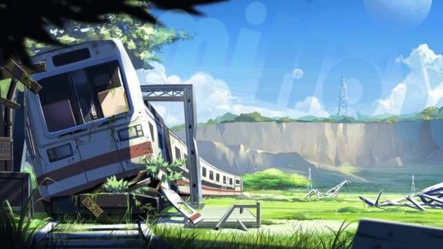
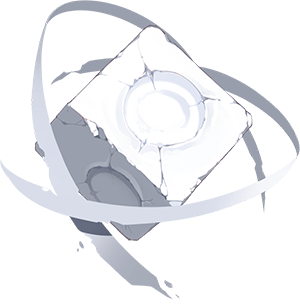

# 使魔大陆

## 这是由人类认知构建出来的，使魔生存的世界——

### 一、使魔大陆的概念

使魔大陆是一块由人类的认知构建出来的世界，其物质基础为崩坏能，所有由人类意识形成地认知都会在这里得到局限化，并形成名“使魔”的生物。

使魔世界与人类的世界中有着可以连通的空间裂缝，方便人类对于使魔进行召唤。

### 二、使魔

使魔产生的缘由各种各样，亦可是祝福，亦可是诅咒，也可能其成为使魔前生而为人。但，无论如何，她们都是在这以崩坏能为物质基础的使魔世界中，由人类意识形成的认知加以具现化而形成的生物。而人类也可通过自己世界与使魔世界连通的空间裂缝，对使魔进行召唤。

使魔们能力各异，她们会利用崩坏能，做出许多特殊而又有自己特性的事，而这种特性也给她们带来了战斗的能力，以至于在战场上召唤出来往往能对自己有所帮助。

### 三、死亡伪典的藏书室

知晓生命与死亡的使魔——死亡伪典家中的藏书馆。仿若档案库一般的存在，在这里，记载着所有死者的过去，也包括使魔们的信息。

### 四、翁德兰大陆

在使魔休伯利安和月光王座的帮助下，她们发现新大陆之后，她们将这座新大陆称为“翁德兰大陆”，而这里也成为了她们新的住所。在这座大陆上有许多特别的风景，也有着更多未知的地方等待着她们去挖掘。

在翁德兰大陆上，有着许许多多神奇的地方，就算在使魔们看来，那也是她们从未见过的壮丽瑰景，彩虹，瀑布，花朵，高塔，列车……一些本来平常的风景，在这里会被赋予新的定义，以一种全新的姿态出现。

### 五、迷途站台

迷途站台，位于翁德兰大陆，铁塔丘陵下方。一列破旧的列车静静躺在倾倒的铁塔之间。SS-2065，车牌上已然漫灭不清的数字，或许记录着它曾经在另一个世界的身份。这辆列车似乎是在行驶到这个站点时，突然被带到这个世界，连同着停靠的那段站台，一起出现在这片平原，就此停靠在了这里，仿佛迷失了自己的方向。

### 六、苍空花束

苍空花束，突兀地生长在峭壁之间。巨大的花瓣周围，云雾缭绕，彷如幻境。苍空花束历千年而盛放，不数日便凋零。能目睹苍空花束绽放的绝景，在这片大陆被视为无上的幸运。苍空花束盛开的这几天，它的种子会随着风吹向大陆各地。然而，在其他任何地方，都再找不到如此巨大的花。

### 七、静默石像

在沉默雨林中，由许许多多这样的地藏菩萨，但是它脸上却带着诡异的笑容。事实上，这座石像有一种可怕的能力，能让进入沉默雨林的人失去力量。哪怕最强大的人，在这里都束手无力，不过它并不会影响肉体本身的力量。只有为这座石像献上祭品，成为它的狂信者才能脱离被“沉默”的苦海。

### 八、幻想构造

与世界树有着某种联系的小小的立方体，当你握着她的时候会有着某种牵引力在指引着你，当你的精神与它取得联系的时候，它会划破空间的屏障，将你带到创造这个小立方体的大树之前。

